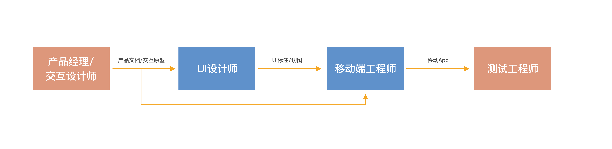

Sketch2Code是一款Sketch插件，可以通过读取符合要求的Sketch
UI设计稿生成移动App
UI代码。(为了简化，从下面开始有些地方会把Sketch2Code简称为S2C)

== Sketch

Sketch是目前主流的UI设计工具，操作简单，针对移动UI设计做了许多优化，非常适合用来进行移动UI设计。它的另一个显著地特点是，Sketch开放了自身的API，可以编写插件对图层进行操作，并且没有什么限制，这使得第三方可以对Sketch进行功能扩展。

可以通过以下链接来进一步了解Sketch:

Sketch官网： https://www.sketch.com

下载Sketch： https://www.sketch.com/updates
（最新版的Sketch需要macOS Catalina系统。这个链接列出了Sketch的所有历史版本，如果你的macOS系统早于Catalina，在这个页面可以找到适合你系统的Sketch版本）

中文使用手册： https://oursketch.com/manual
（Sketch官网的使用手册是英文的。网上有几个中文翻译版本，我觉得这个翻译得还可以）

== Sketch2Code试图解决的问题

下图是App 客户端开发的大致流程（简化了的）

其中App
UI部分的开发是由UI设计师出UI设计稿，然后工程师照着设计稿来还原设计。这个过程相当于设计师使用UI设计工具上把设计稿画了一遍，然后工程师再使用开发工具（比如XCode或Android
Studio)把设计稿又画一遍。由于UI设计包含很多细节，要想做到精准还原设计，工程师需要做很多细致的工作。UI设计师为了保证UI的实现效果，往往需要与工程师花不少精力沟通，要求工程师调界面，一直到满意或达成某种妥协为止。

S2C想达到的目标就是充分利用UI设计稿中已有的信息（比如UI元素的位置、颜色、字体、字号、透明度、圆角等信息），同时用户通过操作插件补充一些对开发UI来说必须要有的信息（比如组件的类型、组件的相对布局信息等）。然后由插件生成UI代码，通过这样的方式来减少工程师的工作量。由于生成的代码是所见即所得的，工程师可以更容易地还原设计，保证还原的质量，这样也减少UI设计师和工程师的沟通量。

== Sketch2Code的组成部分

S2C包括插件端和预览端两个大的部分。

插件端是以Sketch插件形式运行的应用程序，主要包括“组件”、“属性”、“布局”、“转换”、“代码生成”等功能模块。

预览端是一个iOS
App，可以在iOS模拟器或者iOS真机上运行。通过预览端App，用户可以快速预览插件端所生成代码的真实运行效果（通过实时生成并运行与Objective-C代码逻辑相同的Javascript来实现的），从而验证自己在插件端所做的操作是否正确。

== 效果演示

可以通过几个视频来对S2C的效果有一个直观的了解。 https://github.com/lianxianghui/Sketch2CodeDocs/blob/main/VideoIntroduction.adoc[视频介绍与链接]

== 对所生成代码的说明

请参考 https://github.com/lianxianghui/Sketch2CodeDocs/blob/main/CodeDescription.adoc[对所生成代码的说明]

=== 对布局功能的说明
请参考 https://github.com/lianxianghui/Sketch2CodeDocs/blob/main/LayoutIntroduction.adoc[对布局功能的说明]

== 注
目前Sketch2Code还未对外发布，只是个人内部使用。

